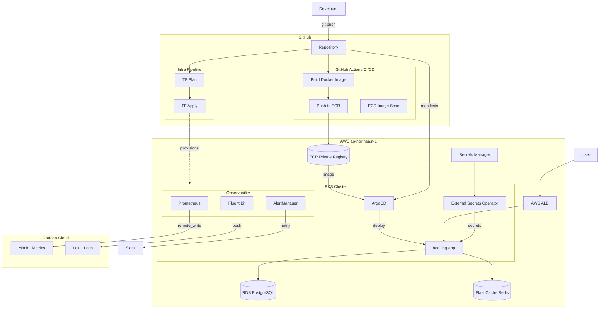

# EKS Infrastructure

Production-grade EKS platform with EC2 worker nodes on AWS Tokyo (`ap-northeast-1`), built with Terraform. Features GitOps deployment via ArgoCD, full observability stack (metrics, logs, alerts), and multi-environment support (DEV / UAT / PROD).

## Architecture



## Tech Stack

| Layer | Technology |
|---|---|
| Infrastructure | Terraform, AWS EKS, VPC, RDS PostgreSQL, ElastiCache Redis |
| Container Registry | AWS ECR (private, lifecycle policies, cross-account replication) |
| GitOps | ArgoCD |
| CI/CD | GitHub Actions + OIDC (no long-lived credentials) |
| Secret Management | AWS Secrets Manager + External Secrets Operator |
| Ingress | AWS Load Balancer Controller (ALB) |
| Metrics | kube-prometheus-stack → Grafana Cloud (Mimir) |
| Logs | Fluent Bit → Grafana Cloud (Loki) |
| Alerts | AlertManager → Slack |
| CNI | AWS VPC CNI |
| Storage | EBS CSI Driver (gp3) |

## Structure

```
.
├── prerequisites/       # Bootstrap — S3 tfstate bucket, GitHub Actions OIDC IAM role
├── main-infra/          # VPC + networking (persistent, apply once)
├── main-platform/       # EKS cluster + worker nodes (destroy/apply daily)
├── modules/
│   ├── vpc/             # VPC, subnets, IGW, route tables
│   └── eks/             # EKS cluster, managed node group, IAM roles
└── .github/workflows/
    └── infra-pipeline.yml   # Plan + manual approval + apply
```

## Prerequisites

- Terraform >= 1.15.0
- AWS CLI configured for `ap-northeast-1`
- GitHub OIDC IAM role deployed (see `prerequisites/`)

## Deployment Order

### 1. Bootstrap (once only)
```bash
cd prerequisites
terraform init -backend-config=aws-tfstate.dev.hcl
terraform apply -var-file=variables.dev.tfvars
```

### 2. VPC (once only)
```bash
cd main-infra
terraform init -backend-config=aws-tfstate.dev.hcl
terraform apply -var-file=variables.dev.tfvars
```

### 3. EKS (daily workflow)
```bash
# Morning — spin up
cd main-platform
terraform init -backend-config=aws-tfstate.dev.hcl
terraform apply -var-file=variables.dev.tfvars

# Connect kubectl
aws eks update-kubeconfig --name eks-eks-dev --region ap-northeast-1
kubectl get nodes

# Night — tear down
terraform destroy -var-file=variables.dev.tfvars
```

## Infrastructure

| Resource | Value |
|---|---|
| Region | `ap-northeast-1` (Tokyo) |
| VPC CIDR | `10.10.0.0/22` |
| Private subnets | `10.10.1.0/26`, `10.10.1.64/26` (`1a`, `1c`) |
| Public subnets | `10.10.0.0/27`, `10.10.0.32/27` (`1a`, `1c`) |
| Kubernetes version | `1.35` |
| Worker node type | `t3a.medium` |
| Node count | min 1 / desired 1 / max 2 |

## State Files

All state stored in S3 bucket `proj-tfstate-dev` (`ap-southeast-7`):

| Stack | Key |
|---|---|
| prerequisites | `eksproj/tfstate_dev.tfstate` |
| main-infra | `proj/eks-infra_dev.tfstate` |
| main-platform | `proj/eks-platform_dev.tfstate` |
