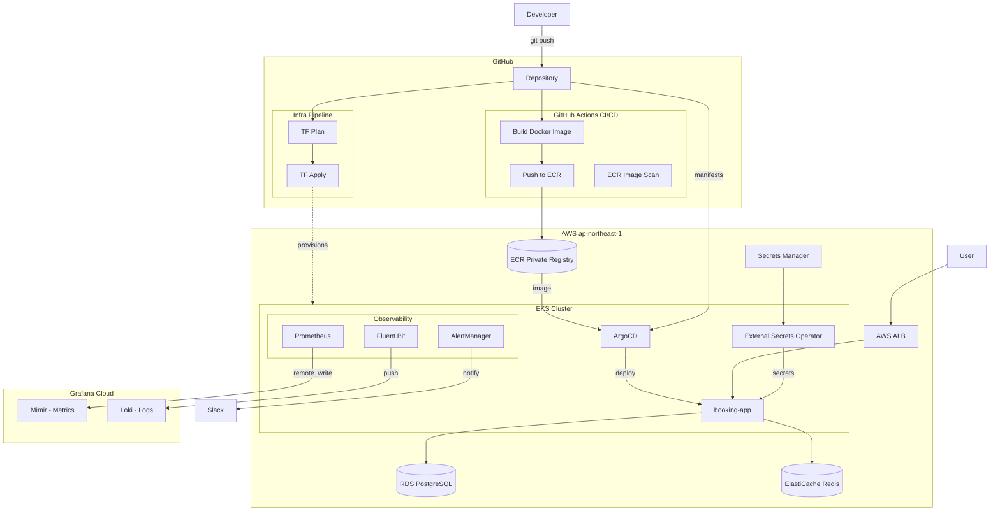

# EKS Platform

Production-grade Kubernetes platform on AWS EKS built with Terraform. Demonstrates GitOps, full observability, multi-environment promotion, and zero-secret-in-git security practices.

> **Region:** `ap-northeast-1` (Tokyo) &nbsp;|&nbsp; **Environments:** DEV · UAT · PROD

---

## Architecture



---

## Key Design Decisions

**GitOps over CI push** — ArgoCD pulls from Git rather than CI pushing to the cluster. This means the cluster state is always traceable to a Git commit. No kubectl in pipelines.

**Zero long-lived credentials** — GitHub Actions authenticates via OIDC (no stored AWS keys). Pods access AWS via IRSA (IAM Roles for Service Accounts). No secrets in environment variables or Git.

**Secrets Manager + ESO** — All sensitive values (DB password, Grafana tokens, Slack webhook) live in AWS Secrets Manager. External Secrets Operator syncs them into K8s Secrets at runtime. Secrets never touch Git or Terraform state in plaintext.

**Multi-account environments** — DEV, UAT, and PROD run in separate AWS accounts. UAT is the build account (ECR source); images replicate to PROD and DEV via ECR replication. Same VPC CIDR across accounts is intentional — no VPC peering between environments.

**Cost-aware cluster lifecycle** — EKS cluster (main-platform) destroys nightly and recreates each morning. VPC and networking (main-infra) persist. This keeps compute costs near zero outside working hours.

---

## Tech Stack

| Layer | Technology |
|---|---|
| Infrastructure as Code | Terraform |
| Compute | AWS EKS 1.35 + EC2 managed node group (`t3a.medium`) |
| Networking | AWS VPC CNI, AWS Load Balancer Controller (ALB) |
| Container Registry | AWS ECR (private, lifecycle policies, cross-account replication) |
| GitOps | ArgoCD |
| CI/CD | GitHub Actions + OIDC |
| Secret Management | AWS Secrets Manager + External Secrets Operator |
| Database | RDS PostgreSQL 17 |
| Cache | ElastiCache Redis 7 |
| Storage | EBS CSI Driver (gp3) |
| Metrics | kube-prometheus-stack → Grafana Cloud (Mimir) |
| Logs | Fluent Bit → Grafana Cloud (Loki) |
| Alerts | AlertManager → Slack |
| Policy | NetworkPolicy, RBAC, PrometheusRule, PodDisruptionBudget |

---

## Environments

| | DEV | UAT | PROD |
|---|---|---|---|
| AWS Account | `298225145086` | `051602877369` | TBD |
| EKS Node Type | `t3a.medium` | `t3a.medium` | `t3a.medium`* |
| Node Count | 1 | 2 | 3 |
| ECR Role | Replication target | Source (builds here) | Replication target |
| Pipeline trigger | Manual checkbox | Runs after DEV | Runs after UAT |

*`m5.large` recommended for real production

---

## Repository Structure

```
.
├── prerequisites/          # Bootstrap: S3 tfstate bucket, GitHub OIDC IAM role
├── main-infra/             # VPC, subnets, ECR, Secrets Manager (persistent)
├── main-platform/          # EKS cluster, ArgoCD, Prometheus, Fluent Bit, ESO (daily)
├── modules/
│   ├── vpc/                # VPC, subnets, IGW, NAT, route tables
│   └── eks/                # EKS cluster, managed node group, IAM roles, IRSA
├── booking-app/
│   ├── app/                # FastAPI application source
│   └── k8s/                # Kubernetes manifests (ArgoCD syncs from here)
├── argocd-apps/            # ArgoCD Application CRDs
└── .github/workflows/
    └── infra-pipeline.yml  # Sequential env-by-env promotion pipeline
```

---

## Deployment

### 1. Bootstrap (once per account)
```bash
cd prerequisites
terraform init -backend-config=aws-tfstate.dev.hcl
terraform apply -var-file=variables.dev.tfvars
```

### 2. VPC + Networking (once, persistent)
```bash
cd main-infra
terraform init -backend-config=aws-tfstate.uat.hcl
terraform apply -var-file=variables.uat.tfvars
```

### 3. EKS Platform (daily)
```bash
# Morning — spin up
cd main-platform
terraform init -backend-config=aws-tfstate.uat.hcl
terraform apply -var-file=variables.uat.tfvars

# Connect kubectl
./playbook-cluster-uat.sh

# Night — tear down (via pipeline destroy job or locally)
terraform destroy -var-file=variables.uat.tfvars
```

### 4. Populate secrets (once after first apply)
```bash
# Grafana Cloud credentials
aws secretsmanager put-secret-value \
  --secret-id grafana-cloud/remote-write \
  --secret-string '{"username":"<prometheus_id>","password":"<api_token>","loki_username":"<loki_id>","loki_password":"<loki_token>"}' \
  --region ap-northeast-1 --profile github-eksuat

# Slack webhook
aws secretsmanager put-secret-value \
  --secret-id alertmanager/slack-webhook \
  --secret-string '{"url":"<webhook_url>"}' \
  --region ap-northeast-1 --profile github-eksuat
```

---

## Observability

| Signal | Collection | Destination | Query |
|---|---|---|---|
| Metrics | kube-prometheus-stack | Grafana Cloud → Mimir | `up`, `kube_pod_status_ready` |
| Logs | Fluent Bit DaemonSet | Grafana Cloud → Loki | `{job="fluent-bit"}` |
| Alerts | AlertManager | Slack `#alerts` | PodCrashLooping, PodNotReady |

---

## Security

- **IAM**: GitHub Actions uses OIDC role (no static keys). Node IAM role is least-privilege.
- **Secrets**: All credentials in Secrets Manager. ESO syncs to K8s Secrets. Nothing in Git.
- **Network**: Default-deny NetworkPolicy on `booking-app` namespace. Allow-list for ALB, Prometheus scrape, RDS/Redis egress.
- **RBAC**: `booking-app-developer` (read + exec) and `booking-app-readonly` roles defined.
- **ECR**: Private registry. Images scanned on push. Lifecycle policy retains last 10 images.
